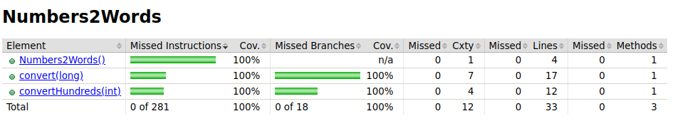
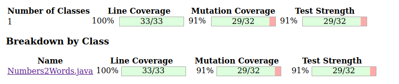

# Number to words converter

A simple application that converts numbers to english words.  
This project was developed using the TDD approach as it can be seen in the commit history.

## Table of content

<!-- TOC -->

* [Number to words converter](#number-to-words-converter)
    * [Technologies](#technologies)
    * [General Info](#general-info)
    * [Setup](#setup)
    * [Result](#result)

<!-- TOC -->

## Technologies

* Java (17)
* Gradle
* pitest
* jacoco

## General Info

* Only long values are allowed.
* No decimal points or currencies are allowed.
* Maximum input value is 999 999 999.

## Setup

After pulling the application you can run:

``
gradle test
``

You can also run mutation testing [(PIT)](https://pitest.org/):

``
gradle pitest
``

## Result

After running the tests, a jacoco [report](build/jacocoHtml) is generated.

Additionally, the mutation [report](build/reports/pitest) is generated.

